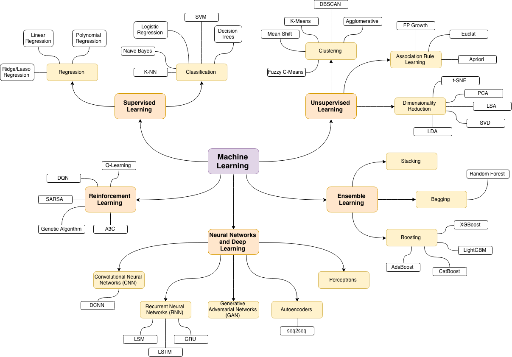

# Fundamentals_of_DS_ML_DL    <br>

 <br>
    


## Content 

  - [Computer vision](#Computer-vision)
  - [Data science](#Data-science)
  - [DataCamp Notes](#DataCamp_Notes)
  - [Deep learning](#Deep-learning)
  - [Fundamentals of python](#Fundamentals-of-python)
  - [Machine learning with tensorflow](#Machine-learning-with-tensorflow)
  - [Machine learning](#Machine-learning)
  - [Resource manuals](#Resource-manuals)
  - [License](#License)
  - [Contributors](#Contributors)
  
## Architecture

<div align="center" style="height:400px"> 
    
 </div>

## Clone git repository

```sh
    $ Git clone "https://github.com/hritik5102/Fundamentals_of_DS_ML_DL"
```

You can run and edit the algorithms or contribute to them using [Gitpod.io](https://www.gitpod.io/), a free online development environment, with a single click.

[](http://gitpod.io/#https://github.com/hritik5102/Fundamentals_of_DS_ML_DL)

## License

Licensed under the [MIT License](LICENSE) 

## Contributors

|     Avatar                                                      |                        Email                |
| --------------------                                            |  -------------------------------------     |
|  [<br /><sub><b>Soofiyan atar</b></sub>](https://github.com/soofiyan)       |        soofiyan.a@somaiya.edu                    |
|  [<br /><sub><b>Hritik Jaiswal</b></sub>](https://github.com/hritik5102)  |               hritik.jaiswal@somaiya.edu         |

<hr/>

